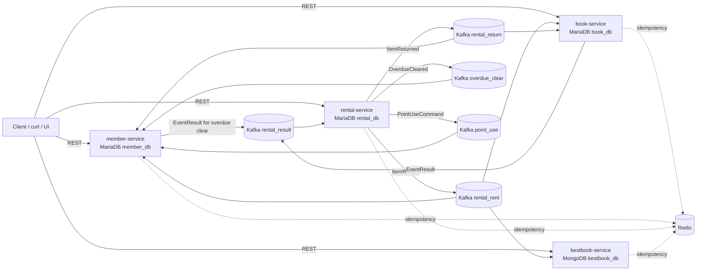
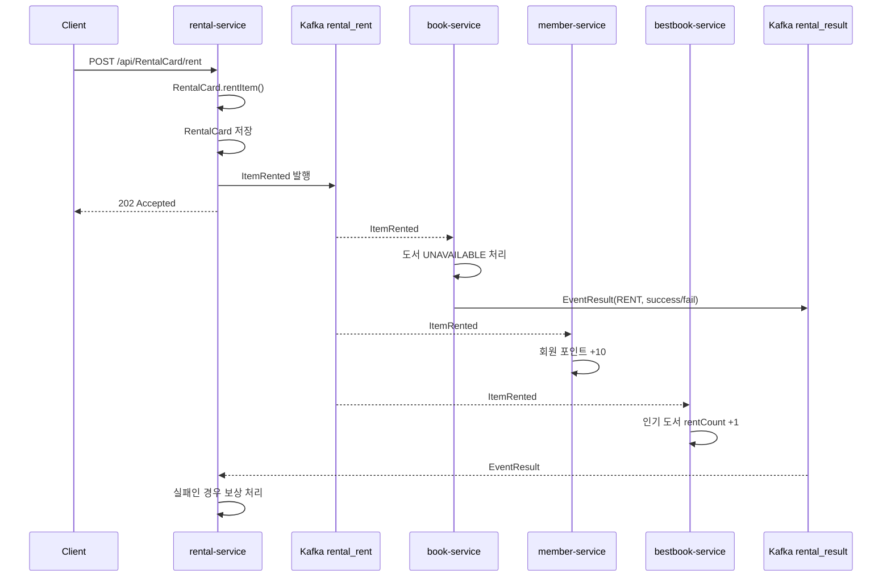
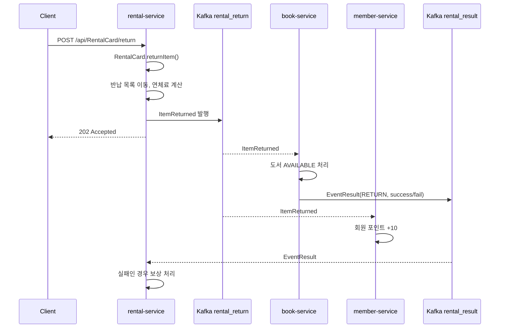
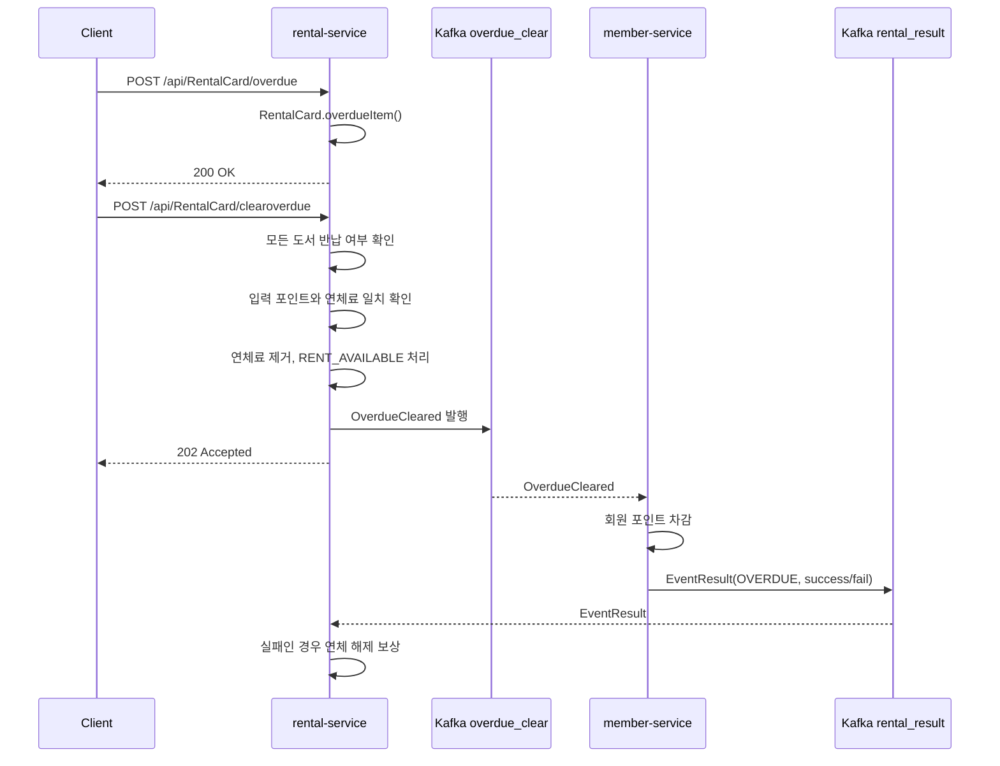
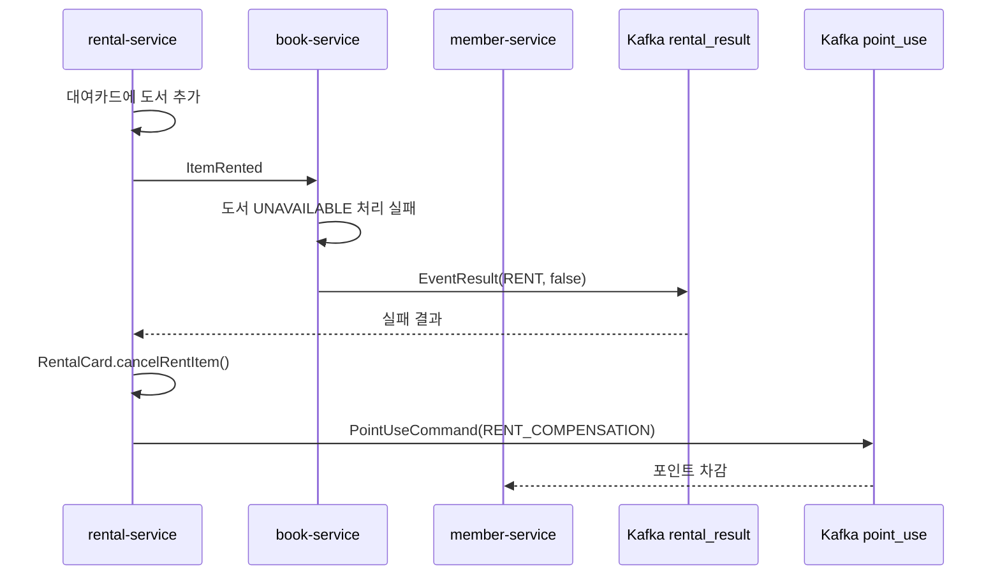
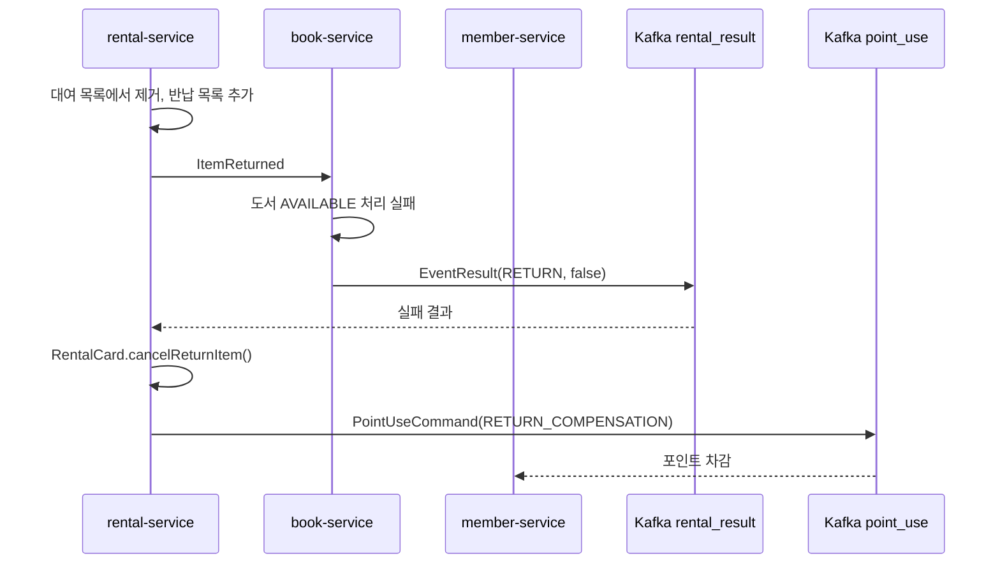
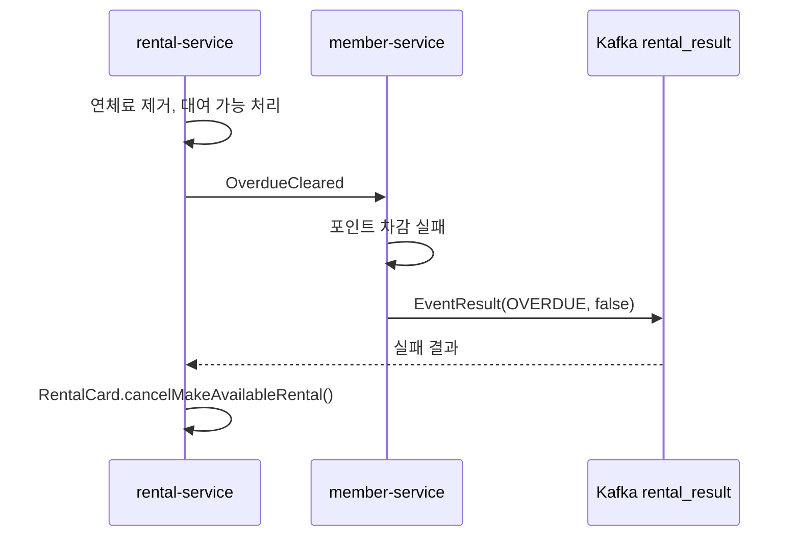

# 사내 도서관 도서 대여 EDA 시스템


Java 21, Spring Boot 3.3.7, Gradle Kotlin DSL 기반의 사내 도서관 대여 시스템입니다.

이 프로젝트는 `member-service`, `book-service`, `rental-service`, `bestbook-service`를 각각 독립된 서비스 경계로 두고, 서비스 간 직접 HTTP 호출 없이 Kafka 메시지로만 협력합니다. 각 서비스 내부는 DDD와 Hexagonal Architecture를 기준으로 `domain`, `application`, `adapter` 계층을 분리합니다.

이 문서에서 말하는 EDA-SAGA는 중앙 오케스트레이터 방식이 아니라, Kafka Result Event를 기반으로 실패를 감지하고 각 서비스의 의미적 보상 동작을 실행하는 Choreography 기반 보상 트랜잭션입니다.

## 핵심 요약

- 대여, 반납, 연체 해제는 `rental-service`가 먼저 자기 상태를 저장한 뒤 Kafka 이벤트를 발행합니다.
- `book-service`, `member-service`, `bestbook-service`는 필요한 이벤트를 구독해 자기 데이터만 변경합니다.
- `book-service`와 `member-service` 일부 흐름은 처리 성공/실패 결과를 `rental_result` 토픽으로 회신합니다.
- `rental-service`는 실패 Result Event를 구독해 대여카드 상태를 되돌리고, 필요한 경우 `point_use` Command Message를 추가 발행합니다.
- Redis는 Kafka Consumer 멱등성 키 저장소로 사용합니다.
- `bestbook-service`는 `rental_rent` 이벤트로 유지되는 MongoDB read model입니다.
- `common-events`는 서비스 간 공유 메시지 계약을 담습니다.
- `common-core`는 공통 성공/오류 응답 포맷과 웹 예외 처리를 제공합니다.
- Outbox, DLQ/DLT, 커스텀 Kafka Retry/Backoff, 분산 추적, SAGA Orchestration은 현재 구현하지 않습니다.

## 모듈 구성

| 모듈 | 실행 포트 | 저장소 | 역할 |
| --- | ---: | --- | --- |
| `common-core` | - | - | 공통 API 응답 `BaseResponse`, 공통 웹 예외 처리, `ErrorCode`, `ErrorResponse`, Spring Boot auto-configuration |
| `common-events` | - | - | Kafka Event, Command, Result, 공통 VO 계약 |
| `member-service` | `8082` | MariaDB `member_db` | 회원 등록/조회, 포인트 적립/사용, 연체 해제 포인트 차감, 보상 포인트 차감 |
| `book-service` | `8081` | MariaDB `book_db` | 도서 등록/조회, 대여 시 이용 불가, 반납 시 이용 가능 |
| `rental-service` | `8080` | MariaDB `rental_db` | 대여카드 생성, 도서 대여/반납, 연체, 연체 해제, 보상 트랜잭션 |
| `bestbook-service` | `8084` | MongoDB `bestbook_db` | 대여 이벤트 기반 인기 도서 read model |

## 업무 개념

| 개념 | 설명 | 소유 서비스 |
| --- | --- | --- |
| 회원 | 도서 대여 사용자입니다. 회원 ID, 이름, 이메일, 비밀번호, 권한, 포인트를 가집니다. | `member-service` |
| 포인트 | 대여/반납 보상으로 적립되고, 연체료 정산이나 보상 흐름에서 차감됩니다. | `member-service` |
| 도서 | 대여 가능한 사내 도서입니다. 상태는 `AVAILABLE`, `UNAVAILABLE`로 관리됩니다. | `book-service` |
| 대여카드 | 회원별 대여 상태 Aggregate입니다. 대여 중 도서, 반납 완료 도서, 연체료, 대여 가능 상태를 관리합니다. | `rental-service` |
| 인기 도서 | 대여 이벤트를 기반으로 유지되는 조회 전용 모델입니다. | `bestbook-service` |

## 전체 런타임 구조



## 아키텍처 원칙

각 서비스는 다음 구조를 따릅니다.

```text
com.example.library.{service}/
├── application/
│   ├── dto/
│   ├── port/
│   │   ├── in/
│   │   └── out/
│   └── service/
├── config/
├── domain/
│   └── model/
├── adapter/
│   ├── in/
│   │   ├── web/
│   │   └── messaging/
│   │       └── consumer/
│   └── out/
│       ├── messaging/
│       └── persistence/
└── infrastructure/
```

계층별 책임은 다음과 같습니다.

| 계층 | 책임 |
| --- | --- |
| `domain.model` | Aggregate, Value Object, 비즈니스 규칙, 상태 전이, 보상 메서드 |
| `application.port.in` | 외부에서 호출할 use case 인터페이스 |
| `application.port.out` | 저장소와 메시징 같은 외부 의존성 추상화 |
| `application.service` | use case orchestration, 트랜잭션 경계, 도메인 호출, 포트 호출 |
| `adapter.in.web` | REST 요청 수신, request DTO 검증, command 변환, response DTO 반환 |
| `adapter.in.messaging.consumer` | Kafka 메시지 수신, 역직렬화, 멱등성 체크, use case 위임 |
| `adapter.out.persistence` | JPA/Mongo 저장소 구현, 도메인과 저장소 모델 매핑 |
| `adapter.out.messaging` | KafkaTemplate을 이용한 메시지 발행, outbound port 구현 |
| `config` | Spring Security, Kafka, QueryDSL 등 설정 |

도메인은 Spring, JPA, Kafka, Redis를 알지 않습니다. Application 계층은 도메인을 사용하고, Adapter 계층이 Spring/JPA/Kafka/Redis 세부 구현을 담당합니다.

## 공통 모듈

### `common-events`

서비스 간 공유 메시지 계약을 담습니다.

| 타입 | 클래스 | 의미 | 주요 필드 |
| --- | --- | --- | --- |
| Domain Event | `ItemRented` | 도서가 대여되었음 | `eventId`, `correlationId`, `idName`, `item`, `point` |
| Domain Event | `ItemReturned` | 도서가 반납되었음 | `eventId`, `correlationId`, `idName`, `item`, `point` |
| Domain Event | `OverdueCleared` | 연체료가 정산되어 대여 정지 해제를 요청했음 | `eventId`, `correlationId`, `idName`, `point` |
| Command Message | `PointUseCommand` | 회원 포인트 차감을 요청함 | `eventId`, `correlationId`, `idName`, `point`, `reason` |
| Result Event | `EventResult` | 참여 서비스 처리 성공/실패 결과 | `eventType`, `successed`, `reason`, 보상용 payload |
| Enum | `EventType` | 결과가 어떤 흐름에 대응하는지 구분 | `RENT`, `RETURN`, `OVERDUE` |
| VO | `IDName` | 회원 식별 값 | `id`, `name` |
| VO | `Item` | 도서 식별 값 | `no`, `title` |

`eventId`는 멱등성 판단에 사용하고, `correlationId`는 같은 비동기 업무 흐름을 묶는 추적 키로 사용합니다. 현재 구현에서는 이벤트 생성 시 `eventId`와 `correlationId`를 같은 UUID로 시작합니다.

### `common-core`

공통 API 응답과 공통 웹 오류 응답을 제공합니다.

- `BaseResponse<T>`: 성공 응답 공통 DTO
- `GlobalExceptionHandler`: 모든 서비스에 자동 적용되는 `@RestControllerAdvice`
- `ErrorCode`: 표준 오류 코드, HTTP 상태, 기본 메시지 enum
- `ErrorResponse`: 클라이언트로 내려가는 오류 응답 DTO
- `CommonCoreAutoConfiguration`: 서비스의 컴포넌트 스캔 범위 밖에 있는 공통 핸들러를 Spring Boot auto-configuration으로 등록

성공 응답 예시는 다음과 같습니다.

```json
{
  "code": 200,
  "message": "요청이 정상적으로 처리되었습니다.",
  "data": {
    "id": "jenny",
    "name": "제니"
  }
}
```

오류 응답 예시는 다음과 같습니다.

```json
{
  "timestamp": "2026-05-01T00:00:00Z",
  "status": 400,
  "error": "Bad Request",
  "code": "VALIDATION_ERROR",
  "message": "요청 값 검증에 실패했습니다.",
  "path": "/api/Member/",
  "fieldErrors": [
    {
      "field": "email",
      "message": "올바른 형식의 이메일 주소여야 합니다"
    }
  ]
}
```

`CommonCoreAutoConfiguration`은 Servlet Web Application에서만 동작하고, 서비스가 별도의 `GlobalExceptionHandler` Bean을 제공하면 공통 핸들러를 등록하지 않습니다.

## Kafka 토픽

| 토픽 | 발행자 | 소비자 | 메시지 | 목적 |
| --- | --- | --- | --- | --- |
| `rental_rent` | `rental-service` | `book-service`, `member-service`, `bestbook-service` | `ItemRented` | 도서 대여 완료 사실 전파 |
| `rental_return` | `rental-service` | `book-service`, `member-service` | `ItemReturned` | 도서 반납 완료 사실 전파 |
| `overdue_clear` | `rental-service` | `member-service` | `OverdueCleared` | 연체 해제 포인트 차감 요청 |
| `rental_result` | `book-service`, `member-service` | `rental-service` | `EventResult` | 참여 서비스 처리 결과 회신 |
| `point_use` | `rental-service` | `member-service` | `PointUseCommand` | 보상 흐름에서 포인트 차감 요청 |

Kafka 메시지는 JSON 문자열로 송수신하고, Consumer는 `ObjectMapper`로 공유 메시지 클래스로 역직렬화합니다.

## REST API 개요

| 서비스 | 메서드 | 경로 | 상태 | 설명 |
| --- | --- | --- | --- | --- |
| `member-service` | `POST` | `/api/Member/` | `201 Created` | 회원 등록 |
| `member-service` | `GET` | `/api/Member/{no}` | `200 OK` | 회원 번호 조회 |
| `member-service` | `GET` | `/api/Member/by-id/{id}` | `200 OK` | 회원 ID 조회 |
| `member-service` | `POST` | `/api/Member/{id}/points/save` | `200 OK` | 포인트 적립 |
| `member-service` | `POST` | `/api/Member/{id}/points/use` | `200 OK` | 포인트 사용 |
| `book-service` | `POST` | `/api/book` | `201 Created` | 도서 등록 |
| `book-service` | `GET` | `/api/book/{no}` | `200 OK` | 도서 조회 |
| `book-service` | `POST` | `/api/book/{no}/available` | `200 OK` | 도서 이용 가능 처리 |
| `book-service` | `POST` | `/api/book/{no}/unavailable` | `200 OK` | 도서 이용 불가 처리 |
| `rental-service` | `POST` | `/api/RentalCard/` | `200 OK` | 회원 대여카드 생성 또는 조회 |
| `rental-service` | `GET` | `/api/RentalCard/{id}` | `200 OK` | 대여카드 조회 |
| `rental-service` | `GET` | `/api/RentalCard/{id}/rentbook` | `200 OK` | 대여 중 도서 목록 |
| `rental-service` | `GET` | `/api/RentalCard/{id}/returnbook` | `200 OK` | 반납 완료 도서 목록 |
| `rental-service` | `POST` | `/api/RentalCard/rent` | `202 Accepted` | 대여 처리 후 대여 이벤트 발행 |
| `rental-service` | `POST` | `/api/RentalCard/return` | `202 Accepted` | 반납 처리 후 반납 이벤트 발행 |
| `rental-service` | `POST` | `/api/RentalCard/overdue` | `200 OK` | 대여 도서 연체 표시 |
| `rental-service` | `POST` | `/api/RentalCard/clearoverdue` | `202 Accepted` | 연체료 정산 후 연체 해제 이벤트 발행 |
| `bestbook-service` | `GET` | `/api/books` | `200 OK` | 인기 도서 목록 |
| `bestbook-service` | `GET` | `/api/books/{id}` | `200 OK` | 인기 도서 단건 |
| `bestbook-service` | `POST` | `/api/books` | `200 OK` | 수동 집계 테스트 |

## 핵심 업무 흐름

### 1. 회원 등록

1. Client가 `member-service`의 `POST /api/Member/`를 호출합니다.
2. `MemberController`가 `MemberRequest`를 검증하고 `AddMemberCommand`로 변환합니다.
3. `MemberService`가 `Member.registerMember(...)`를 호출합니다.
4. `MemberPersistenceAdapter`가 `MemberJpaEntity`로 변환해 MariaDB에 저장합니다.
5. HTTP `201 Created`로 `MemberResponse`를 반환합니다.

회원 등록은 단일 서비스 내부 업무이므로 Kafka를 사용하지 않습니다.

### 2. 도서 등록

1. Client가 `book-service`의 `POST /api/book`을 호출합니다.
2. `BookController`가 `BookRequest`를 검증하고 `AddBookCommand`로 변환합니다.
3. `BookService`가 `Book.enterBook(...)`으로 도서 Aggregate를 생성합니다.
4. `BookPersistenceAdapter`가 `BookJpaEntity`로 저장합니다.
5. HTTP `201 Created`로 `BookResponse`를 반환합니다.

도서 등록도 단일 서비스 내부 업무입니다.

### 3. 대여카드 생성

1. Client가 `rental-service`의 `POST /api/RentalCard/`를 호출합니다.
2. `RentalCardService.createRentalCard(...)`가 회원 ID로 기존 카드를 조회합니다.
3. 기존 카드가 있으면 그대로 반환하고, 없으면 `RentalCard.createRentalCard(...)`로 새 대여카드를 생성합니다.
4. HTTP `200 OK`로 `RentalCardResponse`를 반환합니다.

## EDA 흐름 1: 도서 대여

도서 대여는 `rental-service`가 대여카드 상태를 먼저 바꾸고, 다른 서비스가 이벤트에 반응하는 구조입니다.



상세 동작은 다음과 같습니다.

1. `RentalCardController.rent(...)`가 `UserItemRequest`를 받습니다.
2. `RentalCardService.rentItem(...)`가 대여카드를 조회하거나 없으면 생성합니다.
3. `RentalCard.rentItem(...)`가 도메인 규칙을 검증합니다.
   - 대여 정지 상태면 대여 불가
   - 최대 5권까지 대여 가능
   - 같은 도서 중복 대여 불가
4. 대여카드를 저장합니다.
5. `RentalCard.createItemRentedEvent(...)`로 `ItemRented`를 생성합니다.
6. `RentalKafkaEventProducer.publishRentalEvent(...)`가 `rental_rent` 토픽에 발행합니다.
7. `book-service`는 이벤트를 소비해 도서를 `UNAVAILABLE`로 변경하고 `EventResult(RENT, successed=true/false)`를 `rental_result`로 발행합니다.
8. `member-service`는 이벤트를 소비해 대여 보상 포인트 10점을 적립합니다.
9. `bestbook-service`는 이벤트를 소비해 MongoDB read model의 대여 횟수를 증가시킵니다.

주의할 점: 현재 `member-service`의 대여 포인트 적립 실패는 로그만 남기고 `rental_result`를 발행하지 않습니다. 대여 SAGA 보상은 주로 `book-service` 실패 결과를 기준으로 동작합니다.

## EDA 흐름 2: 도서 반납



상세 동작은 다음과 같습니다.

1. `RentalCard.returnItem(...)`가 대여 목록에서 대상 도서를 찾습니다.
2. 반납일이 연체 기준일보다 늦으면 일수 x 10 포인트를 연체료로 누적합니다.
3. 연체료가 생기면 대여카드를 `RENT_UNAVAILABLE`로 바꿉니다.
4. 대여 목록에서 제거하고 반납 목록에 추가합니다.
5. `ItemReturned`를 `rental_return` 토픽에 발행합니다.
6. `book-service`는 도서를 `AVAILABLE`로 되돌리고 결과를 `rental_result`로 발행합니다.
7. `member-service`는 반납 보상 포인트 10점을 적립합니다.

주의할 점: 현재 API는 `LocalDate.now()`를 반납일로 사용합니다. 장기 연체료 검증은 도메인 테스트 또는 저장 데이터 조정으로 확인하는 편이 정확합니다.

## EDA 흐름 3: 연체와 연체 해제

연체 표시는 `rental-service` 내부 상태 변경입니다. 연체 해제는 회원 포인트 차감이 필요하므로 Kafka 이벤트로 `member-service`와 협력합니다.



연체 해제 조건은 `RentalCard.makeAvailableRental(...)`에 있습니다.

- 대여 중 도서가 없어야 합니다.
- 요청 포인트가 현재 연체료와 정확히 일치해야 합니다.
- 정산 후 연체료가 0이면 대여 상태가 `RENT_AVAILABLE`이 됩니다.

## EDA 흐름 4: 인기 도서 read model

`bestbook-service`는 다른 서비스의 DB를 읽지 않습니다.

1. `rental-service`가 `ItemRented`를 `rental_rent` 토픽에 발행합니다.
2. `BestBookEventConsumer`가 이벤트를 소비합니다.
3. Redis에 `processed:bestbook:{eventId}` 키로 중복 소비 여부를 확인합니다.
4. `BestBookService.recordRent(...)`가 도서 번호로 read model을 찾습니다.
5. 있으면 `rentCount`를 증가시키고, 없으면 새 `BestBook`을 등록합니다.
6. MongoDB `bestbook_db`에 저장합니다.

이 방식은 cross-service read를 직접 HTTP 호출이나 타 서비스 DB 조회로 해결하지 않고, 이벤트로 로컬 조회 모델을 유지하는 패턴입니다.

## EDA-SAGA 구현 방식

현재 구현은 SAGA Orchestration이 아닙니다. 중앙 오케스트레이터가 전체 단계를 명령하고 상태를 저장하는 구조가 아니라, 이벤트와 결과 이벤트를 주고받는 Choreography 기반 보상 트랜잭션입니다.

이 프로젝트에서 SAGA 성격을 갖는 부분은 `rental-service`가 시작한 대여/반납/연체 해제 흐름입니다.

| 원래 작업 | 참여 서비스 | 실패 Result | 보상 위치 | 보상 동작 |
| --- | --- | --- | --- | --- |
| 도서 대여 | `book-service` | `EventResult(RENT, false)` | `rental-service` | 대여 목록에서 도서 제거, 필요 시 `point_use` 발행 |
| 도서 반납 | `book-service` | `EventResult(RETURN, false)` | `rental-service` | 반납 목록 제거, 대여 목록 복원, 필요 시 `point_use` 발행 |
| 연체 해제 | `member-service` | `EventResult(OVERDUE, false)` | `rental-service` | 연체료 재부과, 대여 정지 상태 복구 |

### 보상 실행 지점

`rental-service`의 `RentalEventConsumer`가 `rental_result` 토픽을 구독합니다.

1. `EventResult`를 역직렬화합니다.
2. Redis에 `processed:rental:{eventId}`로 중복 처리 여부를 확인합니다.
3. `RentalResultService.handle(...)`에 위임합니다.
4. `successed=true`이면 로그만 남기고 종료합니다.
5. `successed=false`이면 `eventType`으로 보상 use case를 분기합니다.

```java
switch (result.getEventType()) {
    case RENT -> compensationUseCase.cancelRentItem(result.getIdName(), result.getItem());
    case RETURN -> compensationUseCase.cancelReturnItem(result.getIdName(), result.getItem(), result.getPoint());
    case OVERDUE -> compensationUseCase.cancelMakeAvailableRental(result.getIdName(), result.getPoint());
}
```

### 도메인 보상 메서드

보상은 application service가 임의로 필드를 조작하지 않고, `RentalCard` Aggregate 메서드로 실행합니다.

| 도메인 메서드 | 의미 |
| --- | --- |
| `cancelRentItem(item)` | 대여 성공 후 참여 서비스 실패 시 대여 목록에서 도서를 제거합니다. |
| `cancelReturnItem(item, point)` | 반납 성공 후 참여 서비스 실패 시 반납 목록에서 도서를 제거하고 대여 목록으로 되돌립니다. |
| `cancelMakeAvailableRental(point)` | 연체 해제 성공 후 회원 포인트 차감 실패 시 연체료와 대여 정지 상태를 복구합니다. |

### 대여 실패 보상



보상 이유는 대여 이벤트가 `member-service`에도 전달되어 포인트가 적립되었을 수 있기 때문입니다. `rental-service`는 `point_use` Command Message를 발행해 회원 포인트를 차감합니다.

### 반납 실패 보상



### 연체 해제 실패 보상



이 경우 회원 포인트 차감이 실패했으므로 추가 `point_use`를 발행하지 않고, 대여카드의 연체료와 정지 상태를 되돌립니다.

## Consumer 멱등성

Kafka는 같은 메시지가 재전달될 수 있습니다. 각 Consumer는 업무 처리 전에 Redis에 처리 이력을 기록합니다.

| 서비스 | Redis key |
| --- | --- |
| `book-service` | `processed:book:{eventId}` |
| `member-service` | `processed:member:{eventId}` |
| `rental-service` | `processed:rental:{eventId}` |
| `bestbook-service` | `processed:bestbook:{eventId}` |

구현 방식은 다음과 같습니다.

1. 이벤트에서 `eventId`를 꺼냅니다.
2. `StringRedisTemplate.opsForValue().setIfAbsent(key, "1", Duration.ofDays(7))`를 호출합니다.
3. `true`이면 최초 처리이므로 use case에 위임합니다.
4. `false`이면 이미 처리한 메시지로 보고 로그만 남기고 종료합니다.

현재 구조는 중복 소비 방어를 제공하지만, DB 저장과 Redis 기록, Kafka publish를 하나의 원자적 트랜잭션으로 묶지는 않습니다. 이 부분은 Outbox나 Kafka transaction 없이 구현된 현재 버전의 한계입니다.

## 데이터 저장소

| 서비스 | 저장소 | 저장 모델 |
| --- | --- | --- |
| `member-service` | MariaDB | `MemberJpaEntity` |
| `book-service` | MariaDB | `BookJpaEntity` |
| `rental-service` | MariaDB | `RentalCardJpaEntity`, `RentItemJpaEmbeddable`, `ReturnItemJpaEmbeddable` |
| `bestbook-service` | MongoDB | `BestBookDocument` |

서비스는 자기 DB만 소유합니다. 다른 서비스의 DB를 직접 조회하거나 수정하지 않습니다.

## 실행 방법

### 1. 인프라 실행

```bash
docker compose up -d
```

실행되는 인프라는 다음과 같습니다.

- MariaDB `localhost:3306`
- MongoDB `localhost:27017`
- Redis `localhost:6379`
- Kafka KRaft `localhost:9092`
- Kafka 초기 토픽 생성 컨테이너

### 2. 서비스 실행

Windows PowerShell:

```powershell
.\gradlew.bat :member-service:bootRun
.\gradlew.bat :book-service:bootRun
.\gradlew.bat :rental-service:bootRun
.\gradlew.bat :bestbook-service:bootRun
```

macOS/Linux:

```bash
./gradlew :member-service:bootRun
./gradlew :book-service:bootRun
./gradlew :rental-service:bootRun
./gradlew :bestbook-service:bootRun
```

## 수동 검증 시나리오

### 1. 회원 등록

```bash
curl -X POST http://localhost:8082/api/Member/ \
  -H "Content-Type: application/json" \
  -d '{"id":"jenny","name":"제니","passWord":"1111","email":"jenny@example.com"}'
```

### 2. 도서 등록

```bash
curl -X POST http://localhost:8081/api/book \
  -H "Content-Type: application/json" \
  -d '{"title":"누구를 위하여 종은 울리나","description":"고전 소설","author":"어니스트 헤밍웨이","isbn":"9780000000001","publicationDate":"2023-02-11","source":"SUPPLY","classfication":"LITERATURE","location":"JEONGJA"}'
```

### 3. 대여카드 생성

```bash
curl -X POST http://localhost:8080/api/RentalCard/ \
  -H "Content-Type: application/json" \
  -d '{"userId":"jenny","userNm":"제니"}'
```

### 4. 도서 대여

```bash
curl -X POST http://localhost:8080/api/RentalCard/rent \
  -H "Content-Type: application/json" \
  -d '{"itemId":1,"itemTitle":"누구를 위하여 종은 울리나","userId":"jenny","userNm":"제니"}'
```

확인:

```bash
curl http://localhost:8080/api/RentalCard/jenny
curl http://localhost:8081/api/book/1
curl http://localhost:8082/api/Member/by-id/jenny
curl http://localhost:8084/api/books
```

기대 결과:

- 대여카드에 대여 중 도서가 추가됩니다.
- 도서 상태가 `UNAVAILABLE`로 바뀝니다.
- 회원 포인트가 10점 증가합니다.
- 인기 도서 read model의 `rentCount`가 증가합니다.

### 5. 도서 반납

```bash
curl -X POST http://localhost:8080/api/RentalCard/return \
  -H "Content-Type: application/json" \
  -d '{"itemId":1,"itemTitle":"누구를 위하여 종은 울리나","userId":"jenny","userNm":"제니"}'
```

기대 결과:

- 대여카드에서 대여 중 도서가 제거되고 반납 목록에 추가됩니다.
- 도서 상태가 `AVAILABLE`로 바뀝니다.
- 회원 포인트가 10점 추가 증가합니다.

### 6. 연체 표시와 연체 해제

```bash
curl -X POST http://localhost:8080/api/RentalCard/rent \
  -H "Content-Type: application/json" \
  -d '{"itemId":1,"itemTitle":"누구를 위하여 종은 울리나","userId":"jenny","userNm":"제니"}'

curl -X POST http://localhost:8080/api/RentalCard/overdue \
  -H "Content-Type: application/json" \
  -d '{"itemId":1,"itemTitle":"누구를 위하여 종은 울리나","userId":"jenny","userNm":"제니"}'

curl -X POST http://localhost:8080/api/RentalCard/return \
  -H "Content-Type: application/json" \
  -d '{"itemId":1,"itemTitle":"누구를 위하여 종은 울리나","userId":"jenny","userNm":"제니"}'

curl -X POST http://localhost:8080/api/RentalCard/clearoverdue \
  -H "Content-Type: application/json" \
  -d '{"userId":"jenny","userNm":"제니","point":0}'
```

현재 반납 API는 오늘 날짜를 반납일로 사용하므로 위 예시는 연체 표시와 해제 흐름의 구조 검증에 가깝습니다. 실제 지연 반납에 따른 연체료 계산은 도메인 테스트 또는 DB 날짜 조정으로 확인합니다.

## 실패와 보상 검증

### Book 대여 처리 실패

`book-service`를 실패 플래그와 함께 실행합니다.

```powershell
.\gradlew.bat :book-service:bootRun --args="--app.failure.force-rent-fail=true"
```

그 뒤 대여 API를 호출하면 다음 흐름이 발생합니다.

1. `rental-service`는 대여카드에 도서를 추가하고 `ItemRented`를 발행합니다.
2. `book-service`는 강제 실패를 발생시키고 `EventResult(RENT, false)`를 발행합니다.
3. `rental-service`는 `cancelRentItem(...)`으로 대여를 취소합니다.
4. `rental-service`는 `PointUseCommand(RENT_COMPENSATION)`을 발행합니다.
5. `member-service`는 `point_use`를 소비해 보상 포인트를 차감합니다.

### Book 반납 처리 실패

```powershell
.\gradlew.bat :book-service:bootRun --args="--app.failure.force-return-fail=true"
```

반납 API를 호출하면 다음 흐름이 발생합니다.

1. `rental-service`는 도서를 반납 목록으로 이동하고 `ItemReturned`를 발행합니다.
2. `book-service`는 강제 실패를 발생시키고 `EventResult(RETURN, false)`를 발행합니다.
3. `rental-service`는 `cancelReturnItem(...)`으로 반납을 되돌립니다.
4. `rental-service`는 `PointUseCommand(RETURN_COMPENSATION)`을 발행합니다.
5. `member-service`는 보상 포인트를 차감합니다.

### Member 연체 해제 처리 실패

```powershell
.\gradlew.bat :member-service:bootRun --args="--app.failure.force-overdue-clear-fail=true"
```

연체 해제 API를 호출하면 다음 흐름이 발생합니다.

1. `rental-service`는 연체료를 제거하고 대여 가능 상태로 바꾼 뒤 `OverdueCleared`를 발행합니다.
2. `member-service`는 강제 실패를 발생시키고 `EventResult(OVERDUE, false)`를 발행합니다.
3. `rental-service`는 `cancelMakeAvailableRental(...)`으로 연체료와 대여 정지 상태를 복구합니다.

## 현재 구현 범위와 의도적 제외 항목

현재 구현된 것:

- DDD 도메인 모델
- Hexagonal Architecture 기반 port/adapter 분리
- 서비스 간 직접 HTTP 호출 없는 Kafka EDA
- Domain Event, Command Message, Result Event 구분
- Result Event 기반 Choreography 보상 트랜잭션
- Redis 기반 Idempotent Consumer
- MariaDB 기반 JPA 영속성
- MongoDB 기반 read model
- `common-core` 공통 성공/오류 응답
- Lombok `@RequiredArgsConstructor`, `@Slf4j` 기반 보일러플레이트 제거

의도적으로 구현하지 않은 것:

- Outbox Pattern
- DLQ, DLT, dead-letter publishing
- 커스텀 Kafka retry/backoff
- 분산 추적
- SAGA Orchestration 코드
- 서비스 간 직접 HTTP client 호출

운영상 주의할 점:

- DB 저장과 Kafka 발행은 원자적으로 묶이지 않습니다.
- Consumer 멱등성은 Redis 키로 방어하지만, Redis 기록과 DB 저장도 하나의 원자 트랜잭션은 아닙니다.
- `member-service`의 대여/반납 포인트 적립 실패는 현재 Result Event를 발행하지 않고 로그만 남깁니다.
- 보상 트랜잭션은 물리적 rollback이 아니라 의미적 역동작입니다.
- 장애 메시지 격리를 위한 DLQ가 없으므로 운영 환경에서는 추가 설계가 필요합니다.

## 빌드와 테스트

전체 컴파일:

```powershell
.\gradlew.bat compileJava
```

전체 테스트:

```powershell
.\gradlew.bat test
```

전체 빌드:

```powershell
.\gradlew.bat clean build
```

macOS/Linux에서는 `.\gradlew.bat` 대신 `./gradlew`를 사용합니다.

## 코드 읽는 순서

처음 코드를 읽는다면 다음 순서가 가장 자연스럽습니다.

1. `common-events/src/main/java/com/example/library/common/event`
2. `rental-service/src/main/java/com/example/library/rental/domain/model/RentalCard.java`
3. `rental-service/src/main/java/com/example/library/rental/application/service/RentalCardService.java`
4. `rental-service/src/main/java/com/example/library/rental/adapter/out/messaging/RentalKafkaEventProducer.java`
5. `book-service/src/main/java/com/example/library/book/adapter/in/messaging/consumer/BookEventConsumer.java`
6. `book-service/src/main/java/com/example/library/book/application/service/BookRentalEventService.java`
7. `member-service/src/main/java/com/example/library/member/adapter/in/messaging/consumer/MemberEventConsumer.java`
8. `member-service/src/main/java/com/example/library/member/application/service/MemberEventService.java`
9. `rental-service/src/main/java/com/example/library/rental/adapter/in/messaging/consumer/RentalEventConsumer.java`
10. `rental-service/src/main/java/com/example/library/rental/application/service/RentalResultService.java`
11. `bestbook-service/src/main/java/com/example/library/bestbook/adapter/in/messaging/consumer/BestBookEventConsumer.java`
12. `common-core/src/main/java/com/example/library/common/core/web/GlobalExceptionHandler.java`

이 순서로 보면 대여 이벤트가 어떻게 만들어지고, 어떤 서비스가 반응하며, 실패 결과가 어떻게 보상으로 이어지는지 한 흐름으로 따라갈 수 있습니다.
